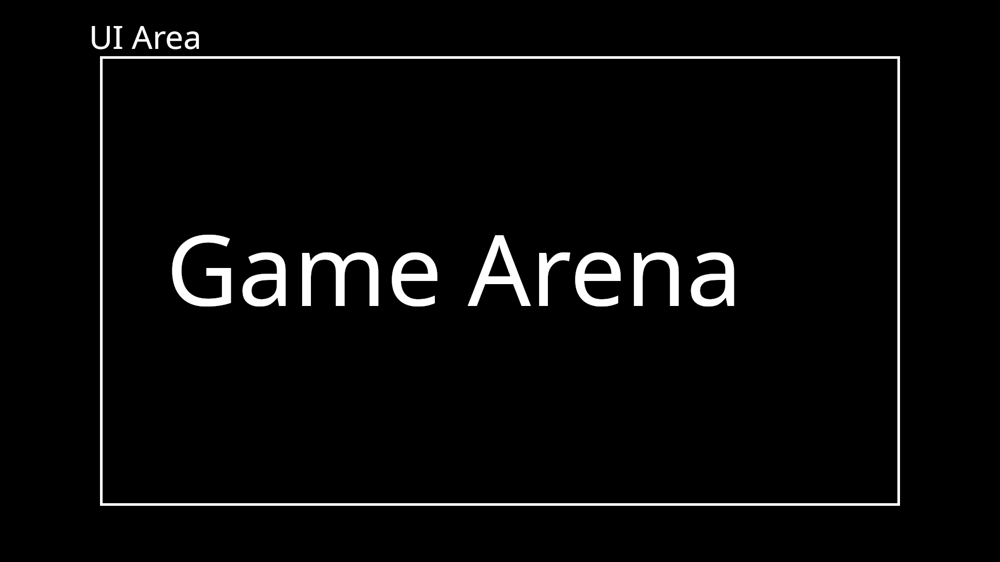

# Rust_ASCII_game_engine

A game engine for 2d top-view games in ASCII.

## Objectives

### Learning

I want this project to help me learn more about the **Rust** language. It might be
a good idea to use the multithreading power of rust to manage separately parts of
the game engine.

I also want to learn more about complex project management, how to plan steps and choose what to implement next

### Ease of use

I want this to be user-friendly in its working ways, to be as documented as possible, and I want
it to be usable by anyone who has a small background in **Rust** programming.

### Self contained

I want do construct everything this project needs (at least the biggest part, I might use some small
crates). This way I'm able to track bugs more efficiently.

### Lightweight

This must be light enough to be run on an old computer. As it is in ASCII, no graphic card is required.

## Interface plan

I have a small idea on how I want the game engine to look. Inspired by Dwarf Fortress, I want it to have
a game area where you can see the game map (or a portion of it around the player), and then I want a contour
where you can put UI (see small drawing below).

## About help

I want this project to be open for suggestions, everyone who want to give some feedback or help
is welcome. I might accept people to come help me work on this project (this is a side-project for me,
I'm not sure I'll have the time to complete it fast enough before it's not fun to me anymore, so don't
hesitate to ask for progress).
